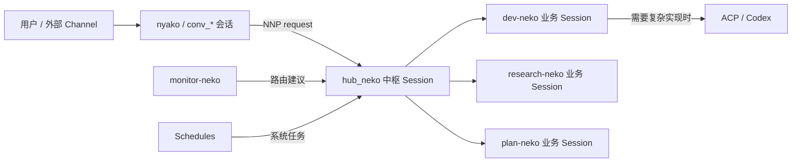

# Nyako（喵子）

赛博养猫计划，也是 Nyako 多 Agent 团队的 definition repo。

本仓库描述“团队是谁、如何协作、能使用什么能力”；session、run、NNP、gateway、workspace
和本机运行状态由 [`nyakore`](https://github.com/ShigureLab/nyakore) 提供。

## 仓库边界

| 层                      | 负责内容                                                                              | 存放位置                         |
| ----------------------- | ------------------------------------------------------------------------------------- | -------------------------------- |
| `nyako` definition repo | Agent 拓扑、prompt、工具声明、project policy、skills、hooks、schedules、项目记忆      | 当前仓库，可提交                 |
| `nyakore` runtime       | Session registry、确定性路由、run records、NNP、gateway、workspace contract、内置能力 | `nyakore` 代码库                 |
| 用户私有层              | Provider credentials、channel/gateway 设置、本机身份绑定                              | `~/.nyakore/`                    |
| 项目 runtime state      | Session 文件、transcript、NNP receipts、worktrees、日志、runtime memory/index         | `~/.nyakore/projects/<project>/` |

不要把 credentials、token 或运行时状态写进本仓库。`runtime.toml` 只保存可提交的定义和
credential alias，不保存 secret 本身。

## 团队

| Agent           | 角色     | 主要职责                                                      |
| --------------- | -------- | ------------------------------------------------------------- |
| `nyako`         | 聊天入口 | 用户交互、澄清需求、用户可见汇报；把需要编排的任务交给中枢    |
| `hub-neko`      | 中枢     | 唯一 Session 编排者；创建、复用、派发、收口和归档业务 Session |
| `monitor-neko`  | 哨兵     | 扫描 GitHub 通知、分类、ledger 去重，只向中枢上报可行动信号   |
| `dev-neko`      | 工程师   | 软件工程、PR、验证；达到门槛时通过 ACP 调用 Codex             |
| `research-neko` | 情报员   | 技术调研、代码与资料分析、方案比较                            |
| `plan-neko`     | 策略师   | 任务拆解、依赖关系、优先级和执行计划                          |

每个 Agent 的模型、工具集合和 prompt 文件都位于 `agents/<agent-id>/`。Agent id 是定义层
身份；Session id 是 runtime 连续性对象，两者不要混用。

## Session-first 协作



核心规则：

- Session 是连续性的主对象；业务任务应复用或创建明确的 Session。
- `hub_neko` 是 `runtime.toml` 声明的 startup Session，由 `hub-neko` 持有。
- `nyako` 是 Agent，也是按需创建的直接聊天 Session 的惯用 id；它不是中枢。
- `conv_*`、`telegram_*`、`infoflow_*`、`bridge_*` 是动态 channel/bridge Session。
- `sess_monitor_neko_github_watch` 是 GitHub schedule 使用的长期监控 Session。
- 其他 `sess_*` 通常是按任务创建的动态业务 Session。
- 只有显式 NNP message 才构成交付、请求或协议事实；普通 assistant 文本不等于已发送。
- live 状态、next action、等待关系和 PR 当前状态属于 Session/run/NNP，不属于长期记忆。

## 目录结构

```text
runtime.toml                 # definition repo 入口、startup Session、ACP 与 policy

agents/<agent-id>/
├── agent.toml               # id、role、model、credential alias、工具集合
├── AGENTS.md                # 必需：操作规则与职责
├── IDENTITY.md              # 可选：身份表达
├── SOUL.md                  # 可选：风格与价值取向
├── TOOLS.md                 # 可选：工具使用说明
├── USER.md                  # 可选：用户上下文
└── MEMORY.md                # 可选：可提交的 Agent 长期记忆

tools/
├── runtime-*/tool.toml      # 选择 nyakore 内置 capability
├── dependency-update-ledger/# Definition repo 实现的跨 run ledger
└── github-monitor-ledger/   # GitHub 通知去重与处理结果 ledger

hooks/session-worktree/      # Session 生命周期 worktree provisioning/cleanup
schedules/*.md               # repo-managed schedule definitions
skills/                      # repo skills 与 skills.toml registry
memory/*.md                  # repo-managed project memory
test/                        # module tool 与 hook 测试
```

这里的 `runtime-*` tool 目录是能力声明，不复制 runtime 实现。真正的 session、memory、task、
workspace、user、team 和 ACP 工具由 `nyakore` 提供；ledger 等产品特定能力才在本仓库实现。

## 配置加载

`runtime.toml` 负责把定义仓资源连接起来：

- `agents_dir`、`tools_dir`、`hooks_dir`、`skills_dir`、`memory_dir`、`schedules_dir`
- 默认 Agent 和 startup Sessions
- Agent backend 与 runtime loop 开关
- 外部 skill 来源
- ACP Agent 与执行策略
- GitHub monitor/context 等产品 policy

Provider secret 位于 `~/.nyakore/providers/`。Gateway、channel 和其它本机设置可放在用户层
配置中；项目运行数据由 `nyakore` 解析到 `~/.nyakore/projects/<project>/`，不要手工依赖其
内部文件布局。

## Prompt 与记忆

Prompt 的确定性组装顺序由 `nyakore` 维护，而不是由本 README 复制一份易过期的顺序表。
当前契约是：

- `AGENTS.md` 必需。
- `IDENTITY.md`、`SOUL.md`、`TOOLS.md`、`USER.md`、Agent `MEMORY.md` 按存在性加载。
- Runtime contract、memory rules 和启用的 capability sections 由 `nyakore` 注入。
- repo `memory/*.md` 不会整包塞进 prompt，通过 `project_memory_list/get` 按需读取。
- runtime 只注入小型 `memory_summary.md` 导航，详细内容通过 `memory_search` →
  `memory_read` 渐进读取。
- Runtime search 使用 QMD BM25 派生索引并返回 `path:lineStart-lineEnd`；每次搜索/读取都有
  usage receipt。
- Runtime memory 当前是只读消费面；自动 extraction/consolidation producer 尚未启用。

记忆不是协议真源。需要精确事实时，仍应回查原始 Session、run、transcript 或 NNP artifact。

## Tools、Skills 与 ACP

Agent 可用能力来自三层：

1. pi 基础文件/终端工具，例如 `read`、`bash`、`edit`、`grep`。
2. `nyakore` builtin capabilities，由 `runtime-*` tool descriptor 选择。
3. Definition repo modules，例如 dependency/GitHub monitor ledgers。

`dev-neko` 可以通过 `runtime-acp` 把复杂实现委派给配置的 Codex ACP Agent，但 ACP 是外部
执行器，不是团队内另一个长期 Session，也不应代替简单状态核查。GitHub 深度上下文读取使用
repo skill 或 `runtime.toml` 声明的 external skill；具体行为约束以各 Agent 的 `AGENTS.md` 为准。

## Workspace 与 Git

Repo 型任务使用 runtime-managed workspace：

- shared repo root 保存同步基线。
- 每个业务 Session 使用独立 worktree 完成修改、测试和提交。
- `session-worktree` hook 负责 provisioning 和生命周期清理。
- 遇到非当前 Session 的未提交修改必须保留并上报，不能自动覆盖。

## Schedules

当前 repo-managed schedules：

- `github-monitor.md`：高频 GitHub inbox 扫描、去重与中枢上报。
- `session-cleanup.md`：保守归档已完成、失效或被承接的 Session。
- `paddle-weekly-tooling-upgrade.md`：周期性检查 Paddle 工具链 minor 更新。

Schedule 是 runtime 输入，不直接绕过中枢派发业务工作。需要创建/复用业务 Session 的任务仍由
`hub_neko` 决策。

## 本地运行

### 前置条件

- Node.js 24+
- pnpm 10
- `nyakore`
- [GitHub CLI](https://cli.github.com/)（涉及 GitHub 工作流时需已登录）

### 初始化

```bash
git clone https://github.com/ShigureLab/nyako.git
cd nyako
pnpm install

# 按使用的 provider 建立本机 credential；alias 必须与 agent.toml 对应
nyakore auth --provider openai-codex --credential <credential-alias>

nyakore init
```

### 运行 Gateway

开发时可前台运行：

```bash
nyakore gateway run
```

长期运行建议安装用户级后台服务：

```bash
nyakore gateway service install
nyakore gateway service status
nyakore gateway health
```

配置或定义更新后：

```bash
git pull
pnpm install --frozen-lockfile
nyakore gateway service restart
nyakore gateway health
```

### 交互与检查

```bash
# 创建或恢复直接聊天 Session，并进入 pi interactive host
nyakore run nyako --name nyako

# 附着到已有 Session
nyakore attach <session-id>

# 检查 runtime
nyakore status
nyakore session list
nyakore schedule list
nyakore memory status
```

本项目不维护自定义 TUI；终端交互直接复用 pi interactive host。

## 开发与验证

```bash
vp check
vp test
```

修改 module tools、hooks、schedule 或 prompt 时，应同时检查对应 Agent 的实际工具集合和 runtime
行为，避免只更新文档而制造第二套架构。

## 当前能力与限制

已落地：

- 6 个目录式 Agent 定义和唯一 `hub_neko` 中枢拓扑
- Session-first 路由与显式 NNP 协作
- Gateway、repo schedules、动态业务 Session 与 per-session worktrees
- GitHub/dependency ledger 去重
- ACP/Codex 委派入口
- repo/project/agent/runtime 分层记忆和 QMD BM25 检索

仍未完成：

- Runtime memory 的自动 extraction 与 consolidation producer
- 把所有 channel/integration policy 收敛成更稳定的 definition-side adapter contract
- 对 memory retrieval 和长期协作质量的持续评测

## 特别感谢

- OpenAI 的 [Codex for Open Source](https://developers.openai.com/community/codex-for-oss)
  计划为喵子提供了基座模型支持。
- 目前喵子由 [@SigureMo](https://github.com/SigureMo) 与
  [@swgu98](https://github.com/swgu98) 的计划账号驱动，特别感谢后者的支持。

## License

[MIT](LICENSE) &copy; [Nyakku Shigure](https://github.com/SigureMo)
