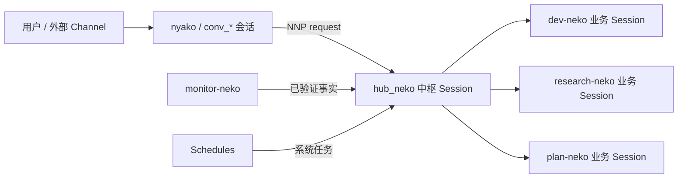

# Nyako（喵子）

赛博养猫计划，也是 Nyako 多 Agent 团队的 definition repo。

本仓库描述“团队是谁、如何协作、能使用什么能力”；session、run、NNP、gateway、workspace
和本机运行状态由 [`nyakore`](https://github.com/ShigureLab/nyakore) 提供。

## 仓库边界

| 层                      | 负责内容                                                                                           | 存放位置                         |
| ----------------------- | -------------------------------------------------------------------------------------------------- | -------------------------------- |
| `nyako` definition repo | Agent 拓扑、prompt、工具声明、project policy、skills、hooks、schedules、Agent `MEMORY.md`          | 当前仓库，可提交                 |
| `nyakore` runtime       | Session registry、显式 Session 寻址与投递、run records、NNP、gateway、workspace contract、内置能力 | `nyakore` 代码库                 |
| 用户私有层              | Provider credentials、channel secret、gateway 设置、本机身份绑定                                   | `~/.nyakore/`                    |
| 项目 runtime state      | Session 文件、transcript、NNP receipts、worktrees、日志、runtime memory/index                      | `~/.nyakore/projects/<project>/` |

不要把 credentials、token 或运行时状态写进本仓库。`runtime.toml` 只保存可提交的定义和
credential alias，不保存 secret 本身。

## 团队

| Agent           | 角色     | 主要职责                                                      |
| --------------- | -------- | ------------------------------------------------------------- |
| `nyako`         | 聊天入口 | 用户交互、澄清需求、用户可见汇报；把需要编排的任务交给中枢    |
| `hub-neko`      | 中枢     | 唯一 Session 编排者；创建、复用、派发、收口和归档业务 Session |
| `monitor-neko`  | 哨兵     | 扫描 GitHub 通知、分类、ledger 去重，只向中枢上报可行动信号   |
| `dev-neko`      | 工程师   | 软件工程实现、PR、验证与 review                               |
| `research-neko` | 情报员   | 技术调研、代码与资料分析、方案比较                            |
| `plan-neko`     | 策略师   | 任务拆解、依赖关系、优先级和执行计划                          |
| `memory-neko`   | 提取器   | 受限地从 idle/completed Session 提取可验证的长期事实          |

每个 Agent 的模型、工具集合和 prompt 文件都位于 `agents/<agent-id>/`。Agent id 是定义层
身份；Session id 是 runtime 连续性对象，两者不要混用。

## Session-first 协作


```mermaid
flowchart LR
    U["用户 / 外部 Channel"] --> C["nyako / conv_* 会话"]
    C -->|"NNP request"| H["hub_neko 中枢 Session"]
    M["monitor-neko"] -->|"已验证事实"| H
    S["Schedules"] -->|"系统任务"| H
    H --> D["dev-neko 业务 Session"]
    H --> R["research-neko 业务 Session"]
    H --> P["plan-neko 业务 Session"]
```

核心规则：

- Session 是连续性的主对象；业务任务应复用或创建明确的 Session。
- `hub_neko` 是 `runtime.toml` 声明的 startup Session，由 `hub-neko` 持有。
- `nyako` 是面向 channel 用户的 Agent；它运行在显式创建的 `conv_*`、`telegram_*` 等 Session 中，不隐式拥有同名 Session。
- `conv_*`、`telegram_*`、`bridge_*` 是动态 channel/bridge Session。
- `sess_monitor_neko_github_watch` 是 GitHub schedule 使用的长期监控 Session。
- Review publication 链路：Monitor 只验证 explicit trusted native request 或 comment，并上报同一
  `trusted_human_review_request`；Hub 直接发送唯一的 `github.review.publish {repo,pr}`；Dev 在这一个
  command 内刷新、锁定、完整审查并发布稳定的 current head，不拆分中间交接阶段。这个
  名字只是内部 command，不是另一套协议，也没有第二套许可、动作或来源副本。
- 同一 `<repo>#<pr>` 只使用一个持续复用的 PR review Session；每次 `github.review.publish` 只是其中
  一次 review cycle。发布 review、review decision、head 变化或 idle 均不结束 Session；只有确认
  PR 已 `MERGED` 才自动归档，closed-unmerged 不归档。
- Direct chat 由 Nyako 原样转交 channel `senderIdentity`，只由 Hub resolve 一次；Hub 不读 GitHub
  或提供 SHA。
- 其他 `sess_*` 通常是按任务创建的动态业务 Session。
- 只有显式 NNP message 才构成交付、请求或协议事实；普通 assistant 文本不等于已发送。
- live 状态、next action、等待关系和 PR 当前状态属于 Session/run/NNP，不属于长期记忆。

## 目录结构

```text
runtime.toml                 # definition repo 入口与 startup Session

adapters/<id>/channel.toml   # nyakore 加载的 channel manifest 与可提交 policy
adapters/github/adapter.toml # GitHub module 自己读取的 integration policy

agents/<agent-id>/
├── agent.toml               # id、role、model、credential alias、工具集合
├── extensions/              # 可选：该 Agent 的 Pi 原生 extensions
├── AGENTS.md                # 必需：操作规则与职责
├── IDENTITY.md              # 可选：身份表达
├── SOUL.md                  # 可选：风格与价值取向
├── TOOLS.md                 # 可选：工具使用说明
├── USER.md                  # 可选：用户上下文
└── MEMORY.md                # 可选：可提交的 Agent 长期记忆

hooks/session-worktree/      # Session 生命周期 worktree provisioning/cleanup
schedules/*.md               # repo-managed schedule definitions
skills/<skill-id>/SKILL.md    # definition repo 自己维护的本地 Skill
skills.lock.toml              # 外部 Skill 的不可变 revision 与目录 digest
memory/config.toml           # runtime memory producer 策略
tools/users/                 # definition-owned bindings, exposed only to Hub
test/                        # extension 与 hook 测试
```

`runtime-session`、`runtime-nnp`、`runtime-workspace` 和 `runtime-memory` 由各 Agent 的
`agent.toml` 直接选择。`runtime-nnp` 只提供 NNP 收发；monitor-neko 使用该窄能力，并以当前
GitHub unread notifications 作为发现入口。Definition-owned extension
直接放在对应 Agent 的 `extensions/` 目录，例如
monitor-neko 的跨 run ledger。只有 `hub-neko` 通过薄 extension 入口使用 `tools/users/` 提供的
`resolve_user_binding`；`nyako` 只原样转交当前 channel 的 `senderIdentity`，避免重复解析。
用户绑定、记录与 policy 都不进入 nyakore runtime contract 或 runtime data root。

绑定记录与工具放在同一个 definition-owned group：`tools/users/bindings/*.toml`。

```toml
id = "example-user"
notificationPeerId = "endpoint:telegram:telegram:user:123456"
identities = ["telegram:user:123456", "github:user:example-login"]
```

工具基于自身文件位置读取记录，不依赖当前工作目录或 `~/.nyakore`。每次查询都重新读取目录，
只接受显式、无冲突的 identity，不根据显示名、邮箱或文本风格推断。可选
`notificationPeerId` 必须指向同一记录里的一项 identity，用于 Hub 的主动结果通知。

## 配置加载

`runtime.toml` 负责把定义仓资源连接起来：

- `agents_dir`、`hooks_dir`、`skills_dir`、`memory_dir`、`schedules_dir`
- 默认 Agent 和 startup Sessions
- runtime loop 开关
- memory 目录位置（默认 `memory/`）

项目根目录的 `skills.lock.toml` 独立声明远程 Skill：`revision` 固定 runtime 实际加载的完整
commit SHA，`digest` 校验整个 Skill 目录，`ref` 只供显式更新时解析。Gateway 每次加载配置时
都会验证 runtime cache；cache 完整时不联网，缺失或损坏时只拉取已锁定的 SHA 并重新校验，
不会在启动或后台定期追踪 `ref`。

Channel policy 放在 `adapters/<id>/channel.toml`，由 nyakore 加载；GitHub integration policy
保留在 `adapters/github/adapter.toml`，只由其 definition-side module 直接读取，nyakore
不会加载或验证该文件。`runtime.toml` 的旧 `[policy]` 已删除。Provider secret 位于
`~/.nyakore/providers/`，channel token/key/secret 位于
`~/.nyakore/config.toml`。用户层不再承载 allowlist、路由 Agent、group policy 等 definition
policy。项目运行数据由 `nyakore` 解析到 `~/.nyakore/projects/<project>/`，不要手工依赖其内部文件布局。

## Prompt 与记忆

Prompt 的确定性组装顺序由 `nyakore` 维护，而不是由本 README 复制一份易过期的顺序表。
当前契约是：

- `AGENTS.md` 必需。
- `IDENTITY.md`、`SOUL.md`、`TOOLS.md`、`USER.md`、Agent `MEMORY.md` 按存在性加载。
- Runtime contract 注入当前 Session goal、artifacts 和启用的必要 capability context。
- runtime memory 不进入常驻 prompt；需要历史事实时通过 `memory_search` →
  `memory_read` 渐进读取，并回查 owning system 的实时状态。
- Runtime search 使用 QMD BM25 派生索引并返回 `path:lineStart-lineEnd`；每次搜索/读取都有
  usage receipt。
- 后台 producer 按 transcript 指纹处理 idle/completed Agent Session：先由无工具的
  `memory-neko` 在一次性隔离 Session 中做受限 JSON extraction，再由 runtime 确定性
  consolidation；失败不推进 cursor，历史 extraction context 不会污染下一个来源。
- 每个 observation 保留 `session:<id>@<fingerprint>` provenance；stage-1 extraction、cursor 和
  consolidation state 位于 runtime memory 的 `pipeline/`，不是 prompt 内容。

记忆不是协议真源。需要精确事实时，仍应回查原始 Session、run、transcript 或 NNP artifact。

## Tools 与 Skills

Agent 可用能力来自三层：

1. pi 基础文件/终端工具，例如 `read`、`bash`、`edit`、`grep`。
2. `nyakore` builtin groups，由 `agent.toml` 直接选择。
3. Agent-owned Pi 原生 extensions，例如 GitHub monitor ledger。

`dev-neko` 在绑定的 Session workspace 中直接完成工程实现和验证；需要独立研究或计划时，
通过明确的 NNP Session 消息与 `research-neko`、`plan-neko` 协作。GitHub 深度上下文读取使用
锁定的 `github-conversation` Skill；具体行为约束以各 Agent 的 `AGENTS.md` 为准。本仓库自己
维护的 Skill 直接放在 `skills/<skill-id>/`，外部 Skill 则写入 `skills.lock.toml`。同名的本地与
远程 Skill 会被拒绝，不能悄悄覆盖。

`nyakore skill sync` 可主动校验并补齐当前锁定版本；正常 Gateway 启动也会完成同样的 cache
维护。只有 `nyakore skill update <name>`（可选 `--ref <ref>`）会解析远程 selector、更新
`revision` 与 `digest`。更新 lock 后需要重启 Gateway；不存在定时更新。

## Workspace 与 Git

Repo 型任务使用 runtime-managed workspace：

- shared repo root 保存同步基线。
- 每个业务 Session 使用独立 worktree 完成修改、测试和提交。
- `session-worktree` hook 负责 provisioning 和生命周期清理。
- 遇到非当前 Session 的未提交修改必须保留并上报，不能自动覆盖。

## Schedules

当前 repo-managed schedules：

- `github-monitor.md`：以当前 GitHub unread notifications 为唯一入口，完成去重与中枢上报。
- `session-cleanup.md`：保守归档已完成、失效或被承接的 Session。

Schedule 是 runtime 输入，不直接绕过中枢派发业务工作。需要创建/复用业务 Session 的任务仍由
`hub_neko` 决策。Schedule body 只描述单轮触发和输出契约；稳定行为策略与精确工具规则分别
属于目标 Agent 的 `AGENTS.md` 和 `TOOLS.md`。

## 本地运行

### 前置条件

- Node.js 24+
- pnpm 10
- `nyakore`
- [GitHub CLI](https://cli.github.com/)（涉及 GitHub 工作流时需已登录）

### 初始化

```bash
git clone https://github.com/ShigureLab/nyako.git
cd nyako
pnpm install

# 按使用的 provider 建立本机 credential；alias 必须与 agent.toml 对应
nyakore auth --provider openai-codex --credential <credential-alias>

nyakore init
```

### 运行 Gateway

开发时可前台运行：

```bash
nyakore gateway run
```

长期运行建议安装用户级后台服务：

```bash
nyakore gateway service install
nyakore gateway service status
nyakore gateway health
```

配置或定义更新后：

```bash
git pull
pnpm install --frozen-lockfile
nyakore gateway service restart
nyakore gateway health
```

需要显式升级远程 Skill 时：

```bash
nyakore skill update github-conversation
git diff -- skills.lock.toml
nyakore gateway service restart
```

### 任务投递与检查

```bash
# 向已有 Session 持久投递任务
nyakore session run --session hub_neko --task "检查当前运行状态"

# 检查 runtime
nyakore status
nyakore session list
nyakore schedule list
nyakore memory status
nyakore memory producer status
```

Session turn 只由 Gateway/runtime 从持久 NNP receipt 消费；终端命令只负责投递和检查，
不会直接接管 Session 执行。

## 开发与验证

```bash
vp check
vp test
```

修改 module tools、hooks、schedule 或 prompt 时，应同时检查对应 Agent 的实际工具集合和 runtime
行为，避免只更新文档而制造第二套架构。

## 当前能力与限制

已落地：

- 6 个业务 Agent、1 个受限 memory extractor，以及唯一 `hub_neko` 中枢拓扑
- Session-first 路由与显式 NNP 协作
- Gateway、repo schedules、动态业务 Session 与 per-session worktrees
- GitHub monitor ledger 去重
- repo/project/agent/runtime 分层记忆、QMD BM25 检索与带 provenance 的自动归并
- runtime channel manifests 与 definition-owned GitHub integration policy；本机层仅保存
  secret/endpoint

## 特别感谢

- OpenAI 的 [Codex for Open Source](https://developers.openai.com/community/codex-for-oss)
  计划为喵子提供了基座模型支持。
- 目前喵子由 [@SigureMo](https://github.com/SigureMo) 与
  [@swgu98](https://github.com/swgu98) 的计划账号驱动，特别感谢后者的支持。

## License

[MIT](LICENSE) &copy; [Nyakku Shigure](https://github.com/SigureMo)
